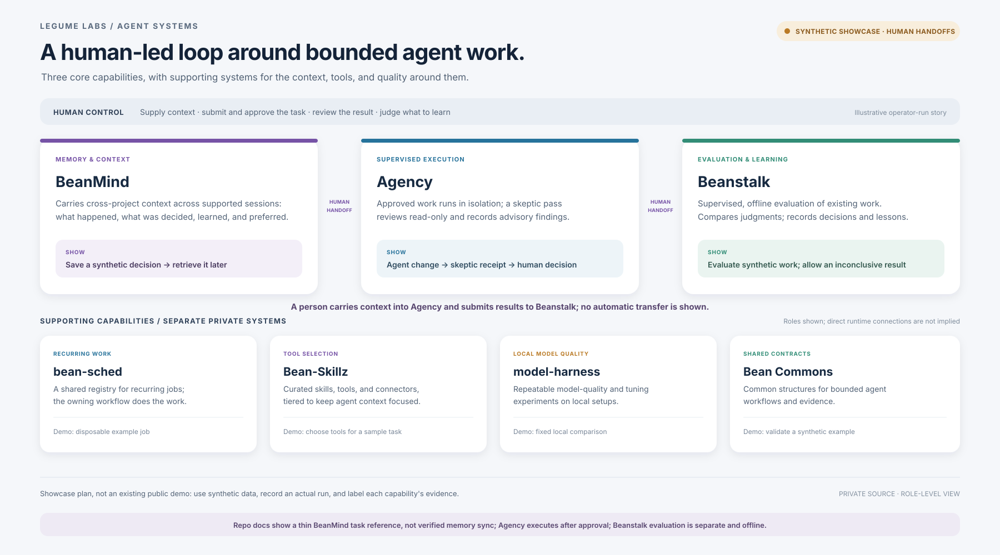

# Agent Systems

**Private-source capability overview · public v0 summary**

Bean Labs has built systems for agent memory, supervised execution, and evaluation, plus supporting tools for recurring work, tool selection, local model quality, and shared contracts. Their source repositories are private; this page summarizes their roles without publishing code or operational details.

The walkthrough below is a proposed showcase using synthetic data. Agency executes approved tasks, while people carry context into a task and results into evaluation. It is not a recorded public demo and does not claim that these separate systems form one automated platform.

## Core agent systems

| System | What it does | Proposed public demo focus |
| --- | --- | --- |
| **BeanMind** | Keeps persistent, cross-project context across supported agent sessions: what was done, decided, learned, and preferred. | Save a synthetic project decision in one session, then retrieve it in a later session. Show only the demo memory. |
| **Agency** | Local-first task coordination for human-approved agent work in isolated workspaces, with results returned for review. | Start with a bounded task, show the approval point, agent progress, resulting change, and human review. |
| **Beanstalk** | Evaluates existing work against a planned review, compares reviewer judgments, and records a decision, lesson, and next step. | Compare synthetic work samples against fixed criteria; show that the conclusion can be positive, negative, or inconclusive. |

## Agency internals worth showing

Agency's model registry routes work through task roles, and its runner includes a post-run skeptic review pass. These are workflow roles rather than persistent personalities:

- **Role-based model routing:** Agency distinguishes work lanes such as primary reasoning, coding, and fast responses. The lanes select models for tasks; they are not independent, self-directed agents.
- **Skeptic review:** after successful work and PR notes, a separate model-based pass reviews the same changes read-only and records advisory findings in a receipt. A person retains the release decision. The proposed demo would show the change, review receipt, and human decision.
- **Task and scope checks:** qualification and change-scope checks help keep the assignment bounded. These are workflow controls, not additional personas.

## How the systems relate today

- **BeanMind → Agency:** BeanMind's project documentation describes a thin task-submission reference to Agency and says the repositories share no runtime state or code. Repository-level memory sync is not established. Supported agent sessions may access BeanMind through their own configuration; whether the Agency runner does so remains unverified. In the proposed demo, a person supplies the relevant context.
- **Agency → Beanstalk:** Agency runs approved agent work and returns a reviewable result. Beanstalk's active workflow is a separate, supervised offline evaluation tool; it does not execute or schedule other workflows. No automatic handoff is documented. In the proposed demo, a person submits the sanitized result and reviewer judgments to Beanstalk.

The end-to-end example is human-directed. Agency's execution and configured reviewer pass happen within an approved task; a person carries context into that task and results into Beanstalk evaluation. A session-level BeanMind connection to the Agency runner remains unverified.

## Supporting capabilities

| System | Role | Proposed public demo focus |
| --- | --- | --- |
| **bean-sched** | Keeps a shared registry for recurring work; execution remains with the workflow that owns each job. | Use a disposable example job and show the trigger and resulting status, without exposing real schedules. |
| **Bean-Skillz** | Curates agent skills, tools, and connectors, with tiers to keep the available context focused. | Compare a few representative capabilities and explain a selection using a sample task. |
| **model-harness** | Runs repeatable local model quality and tuning experiments. | Show a fixed, local comparison and its report; label results as specific to that setup. |
| **Bean Commons** | Defines shared contracts for bounded agent workflows and evidence. | Show a small synthetic input and the structured result the contract accepts. |

## Suggested walkthrough

1. Give the audience a small synthetic project brief and save its key decision in BeanMind.
2. A person carries the relevant context into a bounded Agency task and approves it. Agency runs the agent work in an isolated workspace and returns a change for human review.
3. A person submits a sanitized copy of the result and the required reviewer judgments to Beanstalk against a fixed review plan.
4. Record the evaluation decision and lesson, including an inconclusive result if the evidence is not strong enough.
5. Use the supporting systems as focused demonstrations: a sample recurring job, tool-selection decision, local model comparison, or contract check.

The person running the demonstration carries context and results at the system boundaries. The BeanMind task reference does not establish automatic memory sync, and Beanstalk is not documented as an Agency runtime integration.

## Evidence still needed

The proposed walkthrough has not been recorded as a public demo. A recorded synthetic run could show each system's input, action, resulting artifact, and approval or judgment point without exposing private data. Until then, this page is a role-level description supported by owner-controlled project documentation, not public proof of an integrated platform or production availability.

The [portfolio overview](README.md) covers public products and release evidence. The [source register](SOURCE-REGISTER.md) records the basis and limits of the claims on both pages.
