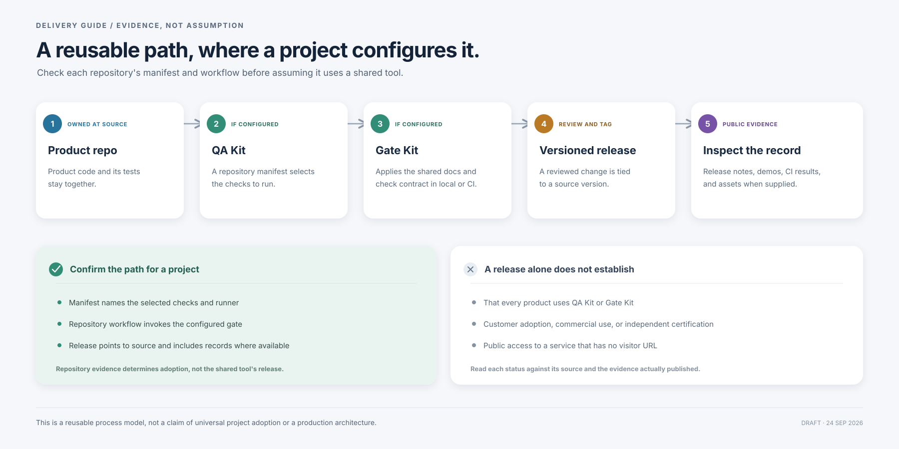

# Product and Delivery Guide

This guide describes four separate products, two shared developer tools, and a reusable release path. It is a portfolio and delivery overview, not a map of deployed services or direct technical dependencies.

## 1. Product boundaries

The products address different jobs. Their public repositories and release pages are separate, and one product's evidence should not be read as evidence for another.

- **Bean Counter** is a local SQLite billing CLI. Its v0.3.0 release includes a synthetic integration walkthrough. Ongoing work is owner-confirmed; the release does not indicate a hosted billing service.
- **BeanFit** estimates model and runtime fit for a device and makes uncertainty visible. Its sample output is an estimate, not a performance benchmark.
- **BeanFit App** provides an account and device companion flow for BeanFit recommendations. A deployed service component is confirmed internally, but the repository does not list a public visitor demo URL. Automatic update alerts remain planned.
- **Jumping Beans** presents a shopper-controlled offer journey. The project is owner-confirmed frozen; its public showcase does not imply active storefront partnerships or live commerce operations.

## 2. Shared developer tools

These public developer tools can provide shared checks, but project-by-project use must be verified from each repository:

1. **QA Kit** reads a repository-owned manifest to select checks and record results.
2. **Gate Kit** applies a documentation and check contract in workflows configured to use it.
3. Product repositories keep the tests that exercise their behavior beside the product code.

These descriptions explain what the tools do. They do not assert that every product repository has adopted the same manifest or gate.

## 3. Reusable release path

Where a repository configures the shared tools, the review path is:

1. Product code and its tests live in the product repository.
2. QA Kit runs the checks selected by that repository's manifest.
3. Gate Kit applies the declared documentation and check contract in the configured local or CI workflow.
4. A reviewed change may be published as a versioned release tied to source.
5. Release notes, demos, CI results, binaries, checksums, and build records provide evidence when supplied.

To confirm adoption for a particular product, inspect its manifest and CI workflow. A release of QA Kit or Gate Kit proves the tools exist; it does not prove every product uses them.

## 4. Status labels

| Label | Meaning here |
| --- | --- |
| **Public source** | A public repository can be inspected. This does not mean its service is publicly accessible. |
| **Released** | A versioned public release exists. This alone says nothing about production use. |
| **Demonstrated** | A public showcase, walkthrough, or reproducible local demo exists. It is not customer adoption evidence. |
| **Deployed · owner-confirmed** | Deployment status comes from the owner's workspace, not a public service URL. It does not imply public visitor access. |
| **Ongoing / frozen / planned** | Work-state labels are owner-confirmed or explicitly documented; they are not inferred from a release date. |

## 5. Evidence route

- [Bean Counter v0.3.0](https://github.com/stevekkall-beansgc/bean-counter/releases/tag/v0.3.0) → [synthetic integration walkthrough](https://github.com/stevekkall-beansgc/bean-counter/blob/v0.3.0/examples/integration/README.md).
- [BeanFit five-minute showcase](https://github.com/stevekkall-beansgc/beanfit/blob/main/README.md#five-minute-showcase).
- [QA Kit showcase](https://github.com/stevekkall-beansgc/qa-kit/blob/main/README.md#five-minute-public-showcase) → [Gate Kit synthetic demo](https://github.com/stevekkall-beansgc/gate-kit/blob/main/README.md#2-run-the-synthetic-demo).
- [Jumping Beans public showcase](https://devpost.com/software/jumping-beans) → [v0.11.0 release](https://github.com/stevekkall-beansgc/jumping-beans/releases/tag/v0.11.0).

The [source register](SOURCE-REGISTER.md) lists the checked public links and separates public evidence from owner-confirmed context.
