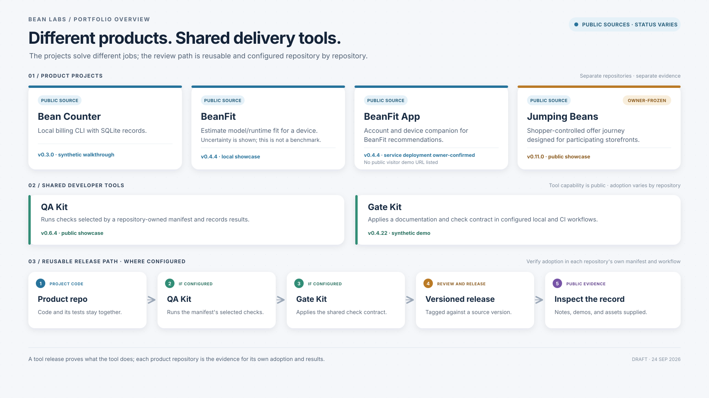

# Bean Labs: Products and Delivery

**Public preview · v0 · public sources checked 2026-09-25**

Bean Labs is a portfolio of separate software products and experiments. The projects solve different problems; QA Kit and Gate Kit provide reusable delivery tools for repositories that adopt them.

This overview shows what each project helps with, what evidence a visitor can inspect, and where project status is confirmed. For a deeper explanation, see the [delivery guide](DELIVERY.md) and [source register](SOURCE-REGISTER.md).

For repository editing rules and the static check, see [AGENTS.md](AGENTS.md).

GitHub Releases record changes to this portfolio overview. Project release versions remain tied to their individual repositories.

## At a glance

**Products and delivery**

**Agent systems**

## Public products

| Project | What it helps with | Public evidence and current status |
| --- | --- | --- |
| [Bean Counter](https://github.com/stevekkall-beansgc/bean-counter) | Keep billing records in a local SQLite database through a command-line workflow. | Public [v0.3.0 release](https://github.com/stevekkall-beansgc/bean-counter/releases/tag/v0.3.0) with a synthetic integration walkthrough. Ongoing work is owner-confirmed; this is not a hosted billing service. |
| [BeanFit](https://github.com/stevekkall-beansgc/beanfit) | Estimate whether model and runtime options may fit a device, with uncertainty made visible. | Public [five-minute showcase](https://github.com/stevekkall-beansgc/beanfit/blob/main/README.md#five-minute-showcase) and [v0.4.4 release](https://github.com/stevekkall-beansgc/beanfit/releases/tag/v0.4.4). Estimates are not benchmark results. |
| [BeanFit App](https://github.com/stevekkall-beansgc/beanfit-app) | Companion account and device flow for BeanFit recommendations. | Public [v0.4.5 release](https://github.com/stevekkall-beansgc/beanfit-app/releases/tag/v0.4.5) and [documented customer flow](https://github.com/stevekkall-beansgc/beanfit-app/blob/main/README.md#beanfit-app). A service component is confirmed internally; no public visitor demo URL is listed. Automatic update alerts are planned. |
| [Jumping Beans](https://github.com/stevekkall-beansgc/jumping-beans) | Explore a shopper-controlled offer journey designed for participating storefronts. | Public [showcase](https://devpost.com/software/jumping-beans) and [v0.11.0 release](https://github.com/stevekkall-beansgc/jumping-beans/releases/tag/v0.11.0). The project is owner-confirmed frozen; the demo does not claim live partner commerce or operations. |

**One engineering path to inspect:** The [BeanFit five-minute showcase](https://github.com/stevekkall-beansgc/beanfit/blob/main/README.md#five-minute-showcase) traces the CLI through hardware detection and evaluation, identifies the [estimate model](https://github.com/stevekkall-beansgc/beanfit/blob/main/src/beanfit/engine/estimate.py), and points to [CLI tests](https://github.com/stevekkall-beansgc/beanfit/blob/main/tests/test_cli.py). Its JSON output includes the model's assumptions, so a reader can inspect how the estimate and its uncertainty are presented. The project explicitly says these estimates are not measured inference performance.

## Shared developer tools

These public tools help teams describe and run checks. Check a repository's own manifest and workflow to see whether it uses them; the [delivery guide](DELIVERY.md) explains what to look for.

| Tool | Role | Evidence |
| --- | --- | --- |
| [QA Kit](https://github.com/stevekkall-beansgc/qa-kit) | Runs checks selected by a repository-owned manifest and records results. | [Public showcase](https://github.com/stevekkall-beansgc/qa-kit/blob/main/README.md#five-minute-public-showcase) · [v0.6.5 release](https://github.com/stevekkall-beansgc/qa-kit/releases/tag/v0.6.5). |
| [Gate Kit](https://github.com/stevekkall-beansgc/gate-kit) | Applies a documented check contract in configured local and CI workflows. | [Synthetic demo](https://github.com/stevekkall-beansgc/gate-kit/blob/main/README.md#2-run-the-synthetic-demo) · [v0.4.22 release](https://github.com/stevekkall-beansgc/gate-kit/releases/tag/v0.4.22). |

## Agent systems

Bean Labs also has three private agent systems: **BeanMind** for persistent context, **Agency** for human-approved execution and read-only skeptic review, and **Beanstalk** for evaluating work and recording lessons. The [agent systems showcase](AGENT-SYSTEMS.md) maps those roles alongside supporting systems for recurring work, tool selection, model quality, and shared contracts. The example is human-directed: Agency executes approved work, while people carry context and results between systems.

## What this overview does not claim

The diagram shows a reusable delivery path, not proof that every product uses every stage. A release or passing check establishes only the evidence it names; it does not by itself prove independent acceptance or general service availability.
